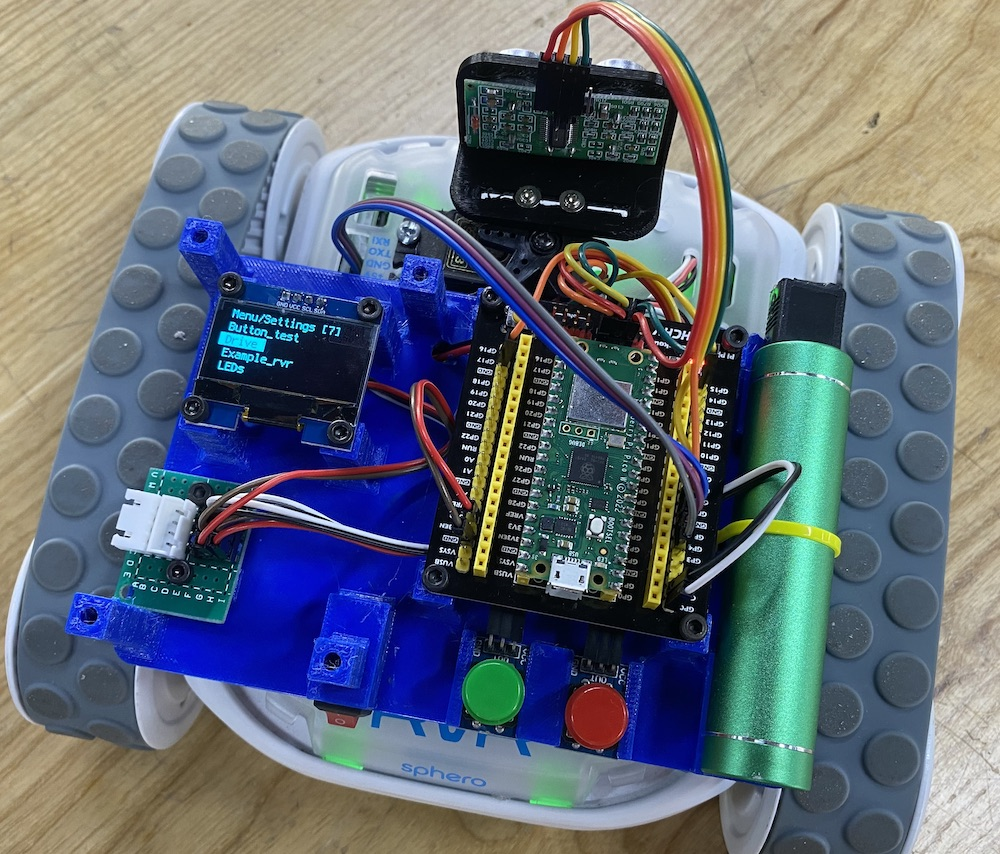
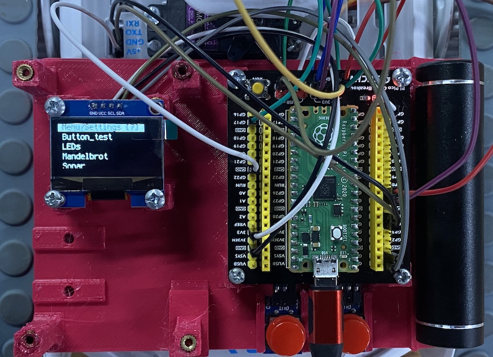
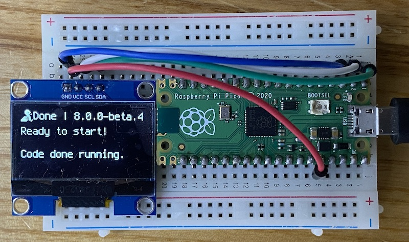

# rvr2023

Controlling the Sphero RVR with a rp2040 over serial in CircuitPython using the rvr API.

## Controller board with input and menu to select program

## 128x64 sh1106 1.3 inch oled

[1.3 inch oled at thegioiic.com](https://www.thegioiic.com/lcd-oled-1-3inch-128x64-chu-xanh-duong-4-chan-giao-tiep-iic)

| TFT   | Pico | Description                                    |
|-------|------|------------------------------------------------|
| VCC   | VSYS | Power Input                                    |
| GND   | GND  | GND                                            |
| A     | GP15 | User button A  --  left button (select)        |
| B     | GP17 | User button B  --  right button  (confirm)     |
| SDA   | GP0  | i2c data line for OLED and external sensors    |
| SCL   | GP1  | i2c clock for OLED and external sensors        |
| TX    | GP4  | TX UART 1                                      |
| RX    | GP5  | RX UART 1                                      |
| TRIG  | GP6  | trigger pin for ultrasonic                     |
| ECHO  | GP7  | echo pin for ultrasonic                        |

# rp2040 and i2c sensors

We would like to just solder a 4-pin JST XH 2.54 mm pitch (0.1 ") connector to any of these boards and then use a standard XH-4 cable to connect to our ssis:bit without worrying about polarity or correct pin order:

The order of pins in the 1mm QUIIC connector is different from the order of the 4 pins found in virtually every hobby board with 2.54mm pins:

Hopefully we soon have a little shelf with all these different sensors for 'plug and play' and a software library on our boards.

## Complete pin list for SPI displays like 240x240 IPS and 320x200 3.2"

| TFT   | Pico | Description                                               |
|-------|------|-----------------------------------------------------------|
| VCC   | VSYS | Power Input                                               |
| GND   | GND  | GND                                                       |
| DIN   | GP11 | MOSI pin of SPI, slave device data input                  |
| CLK   | GP10 | SCK pin of SPI, clock pin                                 |
| CS    | GP9  | Chip selection of SPI, low active                         |
| DC    | GP8  | Data/Command control pin (High for data; Low for command) |
| RST   | GP12 | Reset pin, low active                                     |
| BL    | GP13 | Backlight control                                         |
| A     | GP15 | User button A  -----  left button                         |
| B     | GP17 | User button B  -----  right button                        |
| X     | GP19 | User button X                                             |
| Y     | GP21 | User buttonY                                              |
| UP    | GP2  | Joystick-up                                               |
| DOWN  | GP18 | Joystick-down                                             |
| LEFT  | GP16 | Joystick-left                                             |
| RIGHT | GP20 | Joystick-right                                            |
| CTRL  | GP3  | Joystick-center                                           |
| SDA   | GP0  | i2c data line for OLED and external sensors               |
| SCL   | GP1  | i2c clock for OLED and external sensors                   |
| TX    | GP4  | TX UART 1                                                 |
| RX    | GP5  | RX UART 1                                                 |
| TRIG  | GP6  | trigger pin for ultrasonic                                |
| ECHO  | GP7  | echo pin for ultrasonic                                   |
