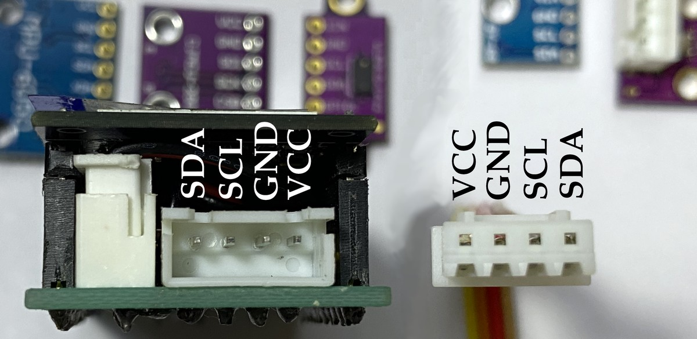
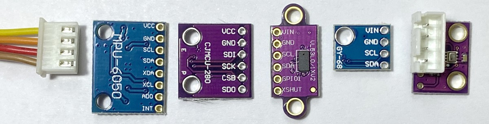

# rp2040 and i2c sensors

We would like to just solder a 4-pin JST XH 2.54 mm pitch (0.1 ") connector to any of these boards and then use a standard XH-4 cable to connect to our ssis:bit without worrying about polarity or correct pin order:

The order of pins in the 1mm QUIIC connector is different from the order of the 4 pins found in virtually every hobby board with 2.54mm pins:

Hopefully we soon have a little shelf with all these different sensors for 'plug and play' and a software library on our boards.